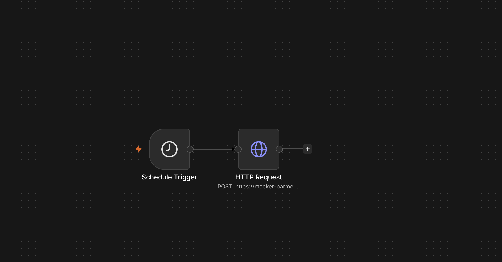

# Workout Logger API

A small REST API for logging and reviewing workouts, built with Python and Flask, backed by SQLite. The API is integrated with an [n8n](https://n8n.io) automation workflow that calls it on a schedule, demonstrating how a custom backend can be plugged into a no-code automation tool.

## What it does

- Log a workout (exercise, duration, date, notes)
- View all logged workouts, with an optional filter by exercise name
- Delete a workout by ID
- View a summary report (times performed and total minutes per exercise)
- Automatically triggered on a schedule via an n8n workflow, which calls the API's `/workouts` endpoint

## Endpoints

| Method | Endpoint                         | Description                                  |
|--------|-----------------------------------|-----------------------------------------------|
| GET    | `/`                                | Health check — confirms the API is running    |
| POST   | `/workouts`                       | Log a new workout                             |
| GET    | `/workouts`                       | List all workouts (newest first)              |
| GET    | `/workouts?exercise=Squats`       | List workouts filtered by exercise name       |
| DELETE | `/workouts/<id>`                  | Delete a workout by its ID                    |
| GET    | `/workouts/summary`               | Aggregate report — times done and total minutes per exercise |

All input is validated: missing or invalid fields return a `400` error with a clear message, and deleting a non-existent workout returns a `404`.

## Database schema

A single `Workouts` table in SQLite:

- `id` — auto-incrementing primary key
- `exercise` — text, required
- `duration_minutes` — number, optional
- `date` — text (defaults to today if not provided)
- `notes` — text, optional

## n8n automation

A scheduled n8n workflow (`n8n-workflow.json`) runs daily and sends a POST request to this API's `/workouts` endpoint to log an entry automatically. See the workflow diagram below.



**Note:** since this API runs locally on my machine (I used [ngrok](https://ngrok.com) for testing), the scheduled n8n workflow only succeeds while my Flask app and ngrok tunnel are both running. This is a demo/portfolio setup rather than a permanently hosted service. A production version would deploy the API somewhere like Render or Railway so it's always reachable.

## Tech stack

- Python 3, Flask
- SQLite (via Python's built-in `sqlite3` module)
- n8n (workflow automation)
- ngrok (temporary public tunnel for local testing)

## Setup

1. Clone the repository and move into it:
   ```
   git clone https://github.com/danielibikunle2/workout-logger-api.git
   cd workout-logger-api
   ```

2. Create and activate a virtual environment:
   ```
   python3 -m venv venv
   source venv/bin/activate
   ```

3. Install dependencies:
   ```
   pip install flask
   ```

4. Create the database:
   ```
   python3 create_db.py
   ```

5. Run the API:
   ```
   python3 app.py
   ```
   The API will be available at `http://127.0.0.1:5001`.

## Example requests

```
curl -X POST http://127.0.0.1:5001/workouts \
  -H "Content-Type: application/json" \
  -d '{"exercise": "Squats", "duration_minutes": 30, "notes": "Leg day"}'

curl http://127.0.0.1:5001/workouts

curl http://127.0.0.1:5001/workouts/summary
```

## Possible future improvements

- Deploy the API to a proper host so it's always reachable, removing the need for ngrok
- Add a PUT endpoint to edit existing workout entries
- Add authentication so the API isn't fully public
- Trigger the n8n workflow from a Telegram or webhook message instead of only a schedule

## Resources used while building this

- [Dave Gray – Python REST API Tutorial: Building a Flask REST API](https://www.classcentral.com/course/youtube-python-rest-api-tutorial-for-beginners-how-to-build-a-flask-rest-api-295926)
- [How to Create a REST API Using Flask](https://www.youtube.com/watch?v=L9q3vjpwsh8)
